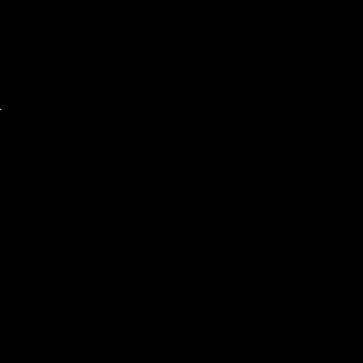

# 2. Grid-based Light Marching



This artifact extends the previous ray casting implementation, introducing a grid-based approach with dynamic lighting and procedural wall generation.

**Note: This approach can get quite CPU intensive as the grid resolution increases. For high-resolution applications, the compute and render should be done in parallel.**

## Key Differences from Previous Version

1. **Grid-based Environment:**
   * Replaced continuous space with a discrete grid system.
   * Environment is now represented as a 2D grid of cells:

```cpp
struct Cell {
   CellType type;
   double luminance;
};

struct Grid {
   std::vector<Cell> cells;
   int width;
   int height;
};
```

2. **Ray Marched Lighting Algorithm:**
   * Switched from direct ray-wall intersection to a step-based ray marching approach; steps along the ray, checking for collisions at each cell while simultaneously updating luminance.

```cpp
void cast_and_illuminate_rays(Grid& grid, point_2d light_source, int num_rays, double max_distance) {
   // Implementation combines ray marching and luminance updating in a single pass
   // Includes checks for diagonal wall detection to prevent light leakage
}
```

3. **Procedural Wall Generation:**
   * Added random wall generation using Bresenham's line algorithm, testing for intersection against discrete coordinates.

```cpp
void setup_walls(Grid& grid) {
   // Generates random walls and a border
}
```

4. **Functional Optimization:**

   * Allows us to interact with environment against standardised and mutable interface. Can inform lighting, terrain (and its destruction), pathfinding etc all against discrete grid, albeit with some performance overhead.

5. **Grid-based Rendering:**

   * The rendering process has been adapted to work with the grid-based system:
     * Each cell in the grid is now rendered individually.
     * Cell appearance is determined by its type (wall or floor) and luminance value.
   * The `draw_grid` function iterates through all cells and renders them based on their properties:

```cpp
void draw_grid(const Grid& grid) {
    for (int y = 0; y < grid.height; ++y) {
        for (int x = 0; x < grid.width; ++x) {
            const Cell& cell = get_cell(grid, x, y);
            color c;
            int luminance = static_cast<int>(cell.luminance * 255);
            if (cell.type == CellType::Wall) {
                c = rgba_color(luminance, luminance, luminance, 255);
            } else {
                c = rgba_color(luminance, luminance, luminance, 100);
            }
            fill_rectangle(c, x * CELL_SIZE, y * CELL_SIZE, CELL_SIZE, CELL_SIZE);
        }
    }
}
```

* These patterns provide a robust and granular state and rendering interface at the expense of compute.

## Future Improvements

* Multiple light sources
* Colour / texture mapping
* Parallel computation for high-resolution grids
* Optimized rendering for large environments (e.g., only render visible cells)
* Further optimization of the ray marching algorithm for specific use cases
