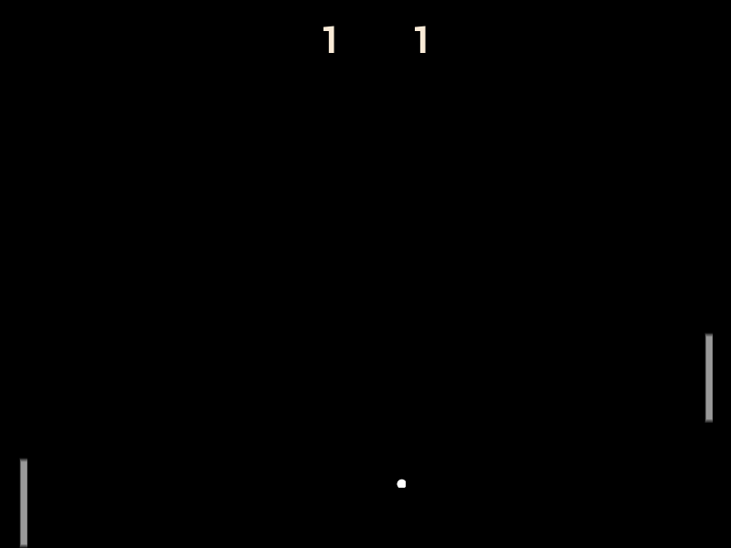

# Homemade Pong

1. Requires a [SplashKit installation](https://splashkit.io/installation/).
2. Build using `skm clang++ *.cpp -o homemade-pong` while in the project folder.
3. Run using `./homemade-pong` while in the project folder.

_See also: usage documentation for [skm](https://github.com/splashkit/skm/blob/master/README.MD) and [SplashKit](https://splashkit.io/guides/using-splashkit/0-overview/)._

## Technical overview

- **Language:** C++
- **Current scope:** Small
- **Code quality:** Fair
- **Gameplay implementation:** Near-complete

## Gameplay overview

A basic pong clone requiring 2 players. Players control paddles vertically to block a ball from crossing their edge of the screen. The ball gains speed as the game continues.

### Player 1 Controls

| Action            | Key              |
|-------------------|------------------|
| Move paddle up    | Up arrow         |
| Move paddle down  | Left arrow       |

### Player 2 Controls

| Action            | Key              |
|-------------------|------------------|
| Move paddle up    | Up arrow         |
| Move paddle down  | Left arrow       |

### Other Controls

| Action            | Key              |
|-------------------|------------------|
| Change background | SPACE            |

## Other notes

- BUG: at high ball speeds the paddle's collision check with the ball fails and the player can no longer block the ball.

## Screenshots

## Credits

Originally created by Anthony George in 2022-T2.
