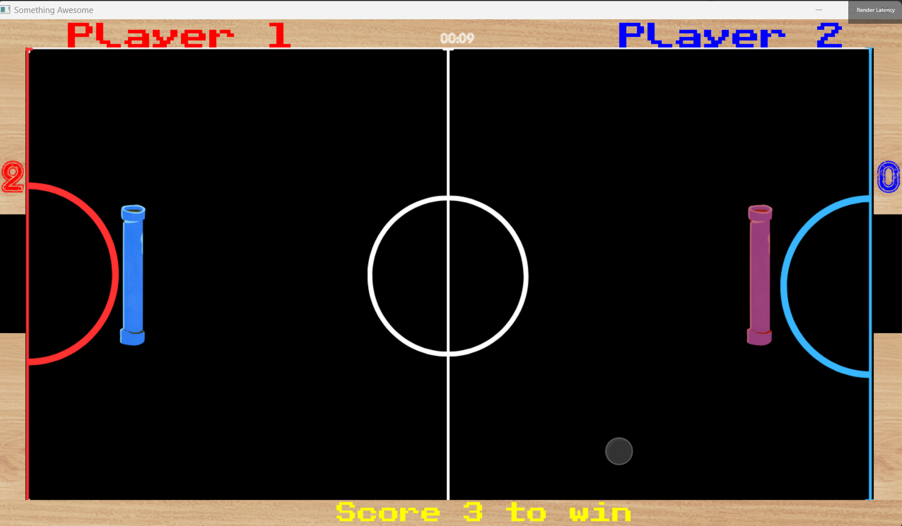

 

**SIT 378 / SIT 78**

**CAPSTONE TEAM PROJECT B**

**DOCUMENTATION**

**PRATHAM GUPTA || 221071691**

PING-PONG

 

*Game Development*

**Documentation**

**1. Introduction**

This documentation serves as a comprehensive guide for the development of the game.

It outlines bug fixes and enhancements aimed at improving the gameplay experience.

The document is designed for both developers and beginners to provide clarity on the

planned features.

**2. Bug Fixes**

***● Vertical Collision with Pipes***

Issue Description:

The current implementation allows the ball to pass through pipes during vertica

collisions, compromising the accuracy of collision detection.

Solution:

Modify the collision detection algorithm to ensure proper interaction between the

ball and pipes. Implement a robust mechanism to prevent the ball from passing

through pipes during vertical collisions.

 

***● Vertical End Collisions with Walls***

Issue Description:

Vertical end collisions with walls permit the ball to move into the walls, leading to

unexpected behavior and disrupting the game mechanics.

Solution:

Refine the wall collision logic to prevent the ball from penetrating walls during

vertical end collisions. Implement a boundary check to ensure the ball remains

within the playable area.

***● End Screen Bugs***

Issue Description:

Undisclosed bugs on the end screen are affecting the transition and display of

game results, hindering a seamless user experience.

Solution:

Identify and address the specific bugs affecting the end screen. Ensure a smooth

transition from gameplay to the end screen, and accurate display of game

results.

***3. Enhancements***

***● Ball Speed Increase***

 

Description:

To introduce a progressive difficulty curve and enhance player engagement, the

ball speed will incrementally increase within each round.

Implementation:

Implement a dynamic speed adjustment mechanism, gradually increasing the

ball speed as players progress through the game. This can be achieved through a

defined algorithm or formula.

**● Map Switch**

Description:

Allow players to switch the background by pressing a designated button,

providing a visual refresh and enhancing the overall gaming experience.

Implementation:

Integrate a background switch feature, associating different maps with unique

buttons. Ensure a smooth transition between backgrounds without impacting

 

gameplay performance.

**● Ball Switch**

Description:

Enable players to switch between different ball types by pressing a designated

button, offering a customization option.

Implementation:

Implement a ball switch mechanism, allowing players to cycle through available

ball types. Ensure seamless integration with existing gameplay mechanics.

 

**● Animation Effects**

Description:

Enhance the visual appeal of the game by incorporating animation effects on the

first and end screens.

Implementation:

Integrate animations using a suitable technology (e.g., CSS animations or SVG

animations). Consider performance implications and provide alternative SVG

animations if needed.

 

*4. Flow Chart*

*5. Conclusion*

This documentation provides detailed insights into the bug fixes and enhancements

planned for the game. Developers are encouraged to reference this document during

implementation, and beginners can use it as a comprehensive guide to understand the

intricacies of the development process. Effective communication and collaboration

among the development team are crucial for the successful implementation and testing

of these features.

 

*Beginner's Comprehensive*

**Guide to the Exciting Game**

**1. Introduction**

Greetings, brave adventurer! Welcome to the immersive world of our thrilling game.

Whether you're a seasoned gamer or just starting your gaming journey, this

comprehensive guide is here to walk you through the ins and outs of the game. Get

ready for an exciting adventure!

 

**2. How to Play**

Before we dive into the improvements, let's quickly go over how to play the game:

● Your goal is to control a ball and navigate it through a series of pipes and

obstacles.

● Use the controls to move the ball and avoid collisions with pipes and walls.

● Reach the end of each level to progress and see your final score on the end

screen.

Now, let's make your gaming experience even better!

*Controls*

Before you embark on your journey, familiarize yourself with the controls:

**Player 1:-**

**● Move Left: [A]**

**● Move Right: [D]**

**● Navigate Up/Down: [W] / [S]**

**Player 2:-**

**● Move Left: [Left Arrow]**

**● Move Right: [Right Arrow]**

**● Navigate Up/Down: [Up Arrow] / [Down Arrow]**

 

*Objective*

Your mission, should you choose to accept it, is to guide a bouncing ball through a

labyrinth of pipes and obstacles. Maneuver your ball with precision, avoid collisions with

pipes and walls, and reach the end of each level to unveil your triumphant score on the

end screen.

**3. Bug Fixes**

**● Issue 1: Ball Passing Through Pipes**

Problem: Sometimes the ball goes through pipes, which shouldn't happen.

Solution: We're fixing the game to ensure that when your ball hits a pipe, it

behaves just like you'd expect—no more mysteriously passing through!

 

**● Issue 2: Ball Moving into Walls**

Problem: The ball can sneak into walls during certain situations.

Solution: We're adjusting things so that your ball stays firmly in play and doesn't

get stuck in the walls. Smooth sailing ahead!

 

**● Issue 3: End Screen Display Problems**

Problem: There are some bugs on the end screen causing display issues.

Solution: We're tidying up the end screen so you can see your results clearly. No

more mysterious glitches!

**4. Exciting Enhancements**

Get ready for some awesome new features that will make your gaming experience even

more enjoyable!

**● Enhancement 1: Gradual Ball Speed Increase**

What's New: As you progress through the game, your ball will speed up, adding

an extra layer of excitement and challenge.

 

Why: To keep things interesting and make you feel like a true gaming champion

as you conquer each level!

**● Enhancement 2: Change Background with a Button**

What's New: Now, you can switch up the game background by pressing a button.

Why: It's a fun way to freshen up your gaming environment and keep things

visually engaging.

**● Enhancement 3: Switch Between Different Balls**

What's New: Choose from different types of balls by pressing a button.

Why: Because everyone likes a bit of personalization! Pick the ball that suits your

style and conquer the game your way.

**● Enhancement 4: Animated First and End Screens**

What's New: Enjoy cool animations on the first and end screens for a more

immersive experience.

Why: We want to make sure your gaming journey starts and finishes with a bang.

These animations will add a touch of magic!

 

*5. Conclusion*

Armed with this guide, you're ready to dive into the game with newfound knowledge and

excitement. Navigate your ball, conquer the challenges, and revel in the improvements

we've crafted just for you. If you encounter any issues or have suggestions, feel free to

reach out. Now, go forth and embark on your epic gaming adventure! Happy gaming!

