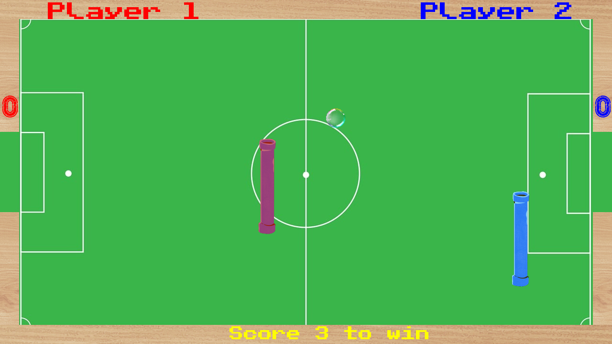

# Ping Pong

1. Requires a [SplashKit installation](https://splashkit.io/installation/).
2. Build using `skm clang++ *.cpp -o ping-pong` while in the project folder.
3. Run using `./ping-pong` while in the project folder.

_See also: usage documentation for [skm](https://github.com/splashkit/skm/blob/master/README.MD) and [SplashKit](https://splashkit.io/guides/using-splashkit/0-overview/)._

## Technical overview

- **Language:** C++
- **Current scope:** Small
- **Code quality:** Fair
- **Gameplay implementation:** Near-complete

## Gameplay overview

A vaguely soccer-themed pong clone requiring two players. Players control paddles freely within their side of the board to prevent the ball from crossing into their goal.

### Player 1 Controls

| Action            | Key               |
|-------------------|-------------------|
| Move paddle up    | W Key             |
| Move paddle left  | S Key             |
| Move paddle down  | S Key             |
| Move paddle right | D Key             |
| RESTART           | R Key             |

### Player 2 Controls

| Action            | Key               |
|-------------------|-------------------|
| Move paddle up    | Up Arrow          |
| Move paddle left  | Left Arrow        |
| Move paddle down  | Down Arrow        |
| Move paddle right | Right Arrow       |
| Exit The Game     | ESC Key           |

## Other notes

- Documentation from the original author is available in `/docs/`.
- BUG: it's possible to move the ball into paddle (or vice versa), causing issues with collision handling.

## Screenshots

## Credits

Originally created by Pratham Gupta in 2023-T2.
