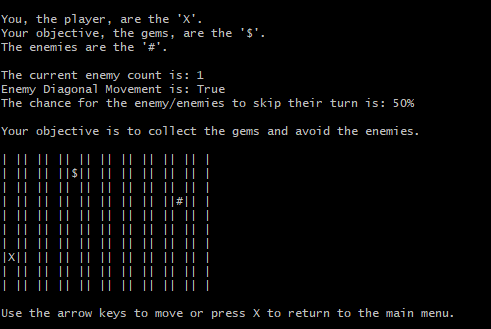

# Runner Dash

## Technical overview

- **Language:** C#
- **Current scope:** Small
- **Code quality:** Poor
- **Gameplay implementation:** Complete

## Gameplay overview

A CLI grid-based turn-based survival action game (?) for one player.

### Player 1 Controls

| Action         | Key           |
|----------------|---------------|
| Move Up        | Up arrow      |
| Move Left      | Left arrow    |
| Move Right     | Right arrow   |
| Move Down      | Down arrow    |
| Return to menu | X             |

## Other notes

- Documentation from the original team is available in `/docs/`.

## Screenshots

## Credits

Originally created by Swanny Aurellia, Norman Spencer Harty, Tulsi Balamurali, and Harney Halls in 2023-T1.
