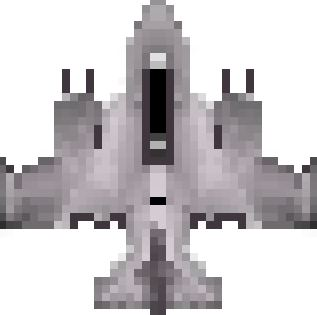
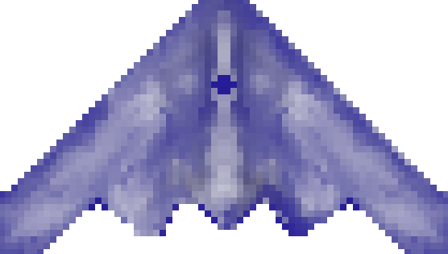
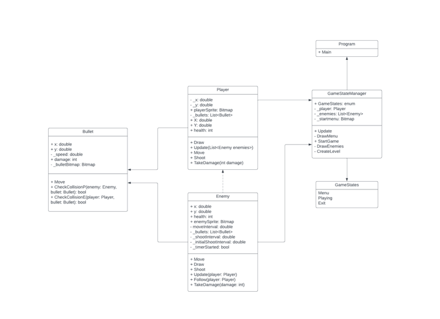

# Sky Surge

## Overview:

Sky Surge is a top-down shooter which draws inspiration from classics such as Strikers 1945. In this game players take control of a powerful aircraft, navigating through challenging levels filled with waves of enemies, power-ups and intense boss battles. This twists conventional shooters through the incorporation of a unique mechanic which causes the player to grow in size and shoot in a larger radius, raising not only the stakes but increasing the sense of accomplishment for players through progression.

## Gameplay Features:

 **1. Dynamic Growth**

 - Destroying enemies increases size and firepower of player’s aircraft
   
 - Larger size makes it harder to maneuver the character but increases  
   the player’s offensive capabilities.
   
 - Allows for more challenging and strategic gameplay
 
 **2. Powerups and Downgrades:**
 
- Collect different powerups found through destroying enemies which help the player to gain limited amount of special abilities.

- Getting hit remove the last ability gained as well as downgrading the firepower and size of player.

**3. Point and Leaderboard System:**
- Gain points by shooting and killing enemies  

- Points are added and saved for the top four players at the end screen 

- Score is reset if the player is hit

**4. Customizability:**
- Three selectable aircrafts available which have different attack patterns and spread 

-  Allowing for more personalized experience

**5. Visual and Audio Design:**
- This will consist of mostly pixel art allowing for a consistent aesthetic throughout all the arcade games already created 

- Art will comprise of real-world recognizable aircrafts simplified to the format 

- Dynamic soundtrack which changes as the level progresses

**6. Control Scheme:**
- An easy two button combat system will be incorporated for activating powerups and shooting

- Standard four button movement
- Arrow keys to move (Up, Down, Left, Right)
- Spacebar to shoot

## Example Sprites

## UML Class

