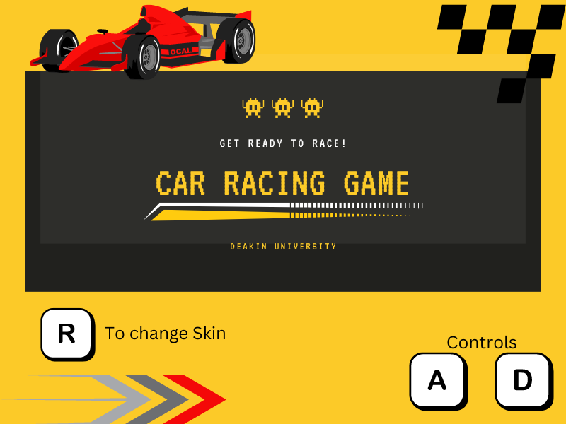
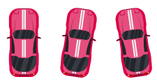
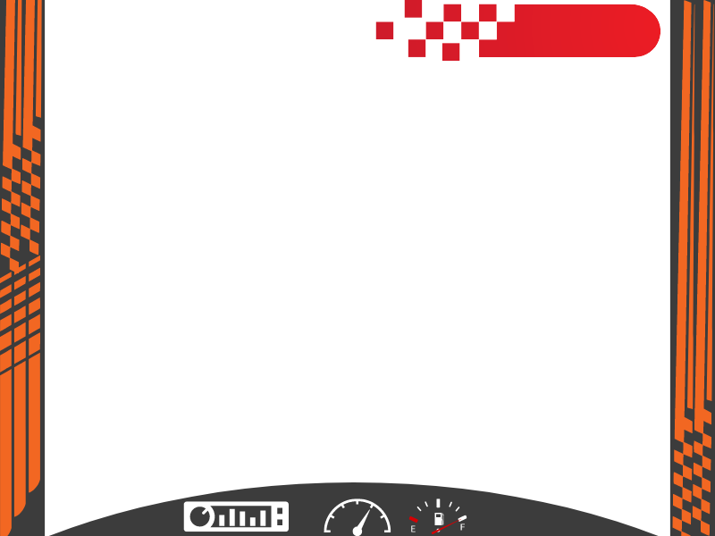
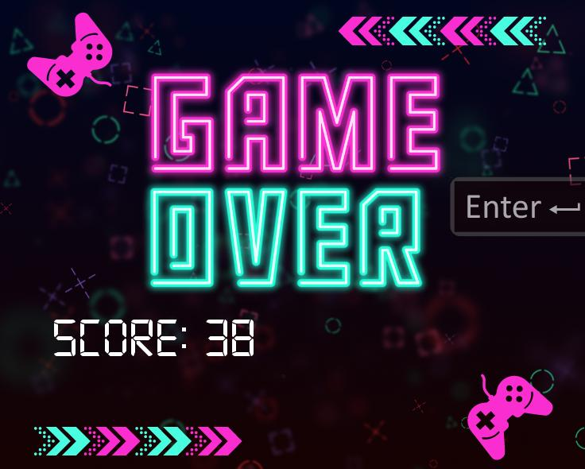
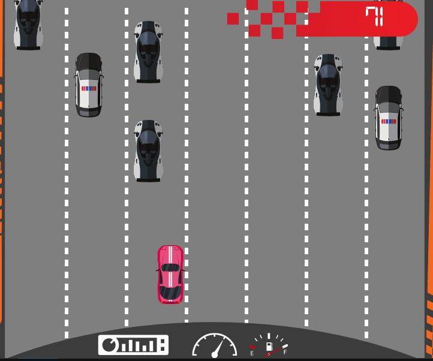
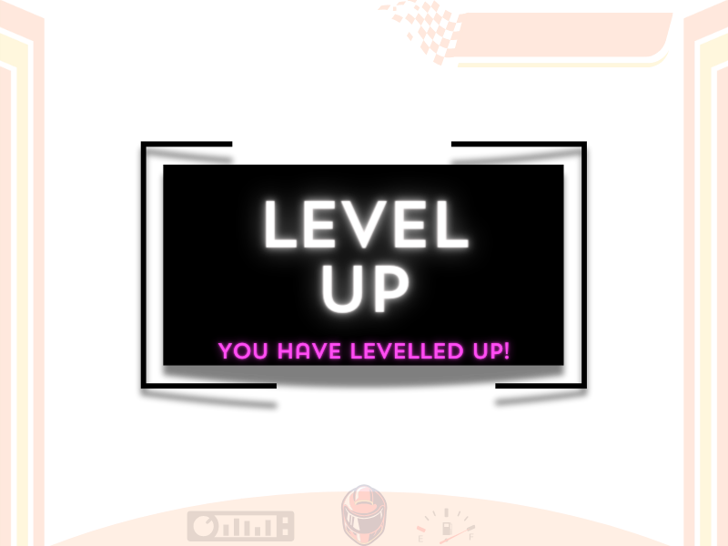

# CAR-RACING

## How to Install

- Install [Splashkit](https://www.splashkit.io) to your computer
- Enter to your terminal and open the project folder
- Enter command `skm clang++ *.cpp -o abcc` to build the file
- Enter command `./abcc.exe` to play the game
- Press ENTER button to start the game

### *Rules*

Note: A and D rules are for player one and the arrow rules are for player 2

| Input | Description |
| --- | ----------- |
| A Key | Car goes LEFT |
| D Key | Car goes RIGHT |
| R Key | Change The Car Colour Between The Game |
| Left Arrow Key | Car goes LEFT For Player 2 |
| Right Arrow Key | Car goes RIGHT For Player 2|

## Documentation

## Introduction

The Car Race game developed by me using the Splash Kit SDK. The game is a basic arcade-style car game where the player's objective is to navigate a car on a road while avoiding collisions with other cars.

## Game Design

I started by designing the basic rules of the game. The game features a car that is spawned on a road and needs to avoid other cars approaching it. The game is designed to have a vertical orientation with a resolution of 800x600 pixels.

## Drawing and Animation

To create the lane road animation, I took inspiration from the thoth-tech/arcade-games 2D racing demo. I spent time understanding animations in C++ and utilized C# functions to adapt to the required changes.

After successfully implementing the animation and car movement, I created a template on Canva for the score and overall theme of the game.

## Car Structure and Functionality

I designed the structure and functions for the cars in the game. The player's car was initialized within the game, and a handle_input() function was implemented to enable car movement. Additionally, a vector was defined to store the obstacle cars, which are spawned every 2 seconds with random speeds. A function was created to initialize these cars and store them in the vector. To optimize memory allocation, a check was implemented to remove cars that went out of the screen (bottom) from the vector.

## Scoring and Collision

The game includes a scoring mechanism that increments the score within a loop. I also implemented a collision function to detect collisions between the player's car and the obstacle cars. If a collision occurs, the game ends.

## Conclusion

In conclusion, I successfully designed a Car Race game using the Splash Kit SDK. The game features a player car that needs to avoid collisions with obstacle cars while navigating a road. I implemented various functionalities such as car movement, obstacle spawning, scoring, collision detection, and additional features like sound effects and screen phases. The game provides an engaging and enjoyable experience for players.

# Updates to the game 

In this game, I updated the multiplayer mode where two players can play simuntaneously, also have powerups added like slow down, money, and shield.
The game is also introduced with barricade and new sound with scenerary. The game has also pause feature enabled which helps user to get the break between the game. The player also get level up feature where at 1000 score finish line appear and speed increases.

## Two Players Menu
Update Description:
Added a menu option for selecting the number of players. Players can choose to play the game either solo or with a friend in two-player mode.

Implementation Details:

- Created a menu screen with options for one or two players.
- Implemented logic to switch between single-player and two-player modes based on user selection.
- Updated the game initialization function to accommodate two players, initializing separate cars for each player.

## Pause Function
Update Description:
Implemented a pause function that allows players to pause and resume the game at any time during gameplay.

Implementation Details:

- Added a pause button or keybind that toggles the game state between paused and running.
- Implemented logic to freeze all game elements (e.g., car movement, obstacle spawning) when the game is paused.
- Added a pause menu overlay with options to resume the game or return to the main menu.

## Two players Mode
Update Description:
Implemented a two-player mode where two players can play simultaneously on the same screen, each controlling their own car.

Implementation Details:

- Initialized separate car objects for each player.
- Assigned distinct controls for each player (e.g., arrow keys for Player 1, A/D keys for Player 2).
- Updated collision detection logic to handle interactions between two player cars.

## Single Player with powerups 
Update Description:
Introduced power-up items (shield, speed boost, slow down, coin) that appear randomly on the track, providing various benefits or hindrances to the player.

Implementation Details:

- Created power-up objects with different effects and visual representations.
- Implemented logic to spawn power-ups at random intervals during gameplay.
- Added collision detection for the player's car with power-up items.
- Applied power-up effects when collected by the player's car.

## Barricade and Level Up
Update Description:
Added barricade obstacles on the track and introduced a level-up feature where the player advances to the next level upon reaching a certain score threshold.

Implementation Details:

- Designed barricade objects with random gap locations for cars to pass through.
- Implemented logic to spawn barricades at regular intervals during gameplay.
- Added collision detection for the player's car with barricade obstacles.
- Introduced a level-up system where the game speed increases and a finish line appears after reaching a specific score.

# Thank You :)