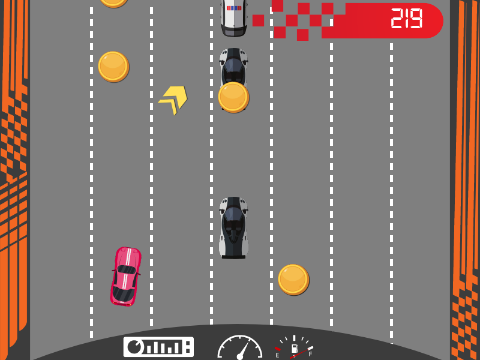
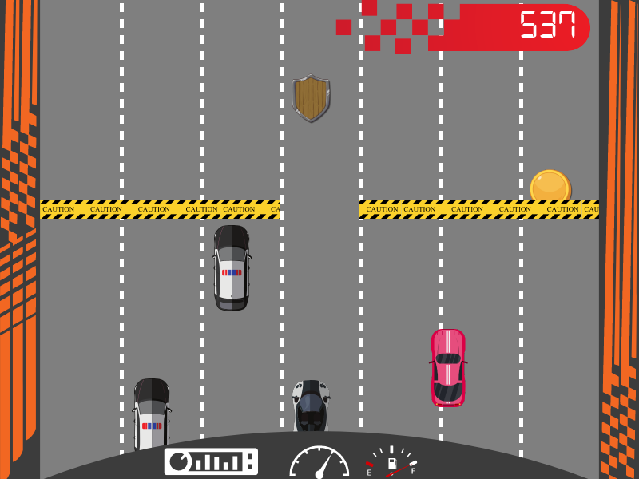

# Car Race

1. Requires a [SplashKit installation](https://splashkit.io/installation/).
2. Build using `skm clang++ *.cpp -o car-race` while in the project folder.
3. Run using `./car-race` while in the project folder.

_See also: usage documentation for [skm](https://github.com/splashkit/skm/blob/master/README.MD) and [SplashKit](https://splashkit.io/guides/using-splashkit/0-overview/)._

## Technical overview

- **Language:** C++
- **Current scope:** Small
- **Code quality:** Fair (unaddressed segfaults)
- **Gameplay implementation:** Near-complete

## Gameplay overview

A racing-themed vertical dodge game supporting 1-2 players. Players must avoid collisions with cars and other obstacles while they drive along a road and collect powerups.

### Player 1 Controls

| Action        | Key           |
|---------------|---------------|
| Move Left     | A             |
| Move Right    | D             |
| Change sprite | R             |

### Player 2 Controls

| Action        | Key           |
|---------------|---------------|
| Move Left     | Left arrow    |
| Move Right    | Right arrow   |

## Other notes

- Old documentation from the original author is available in `/docs/`.
- BUG: Game has unaddressed segfault conditions. Triggers include attempting to re-play the game after losing.
- BUG: Barriers sometimes spawn across the entire road, guaranteeing a loss.

## Screenshots

## Credits

Originally created by Khushi Laddi in 2023-T2.
