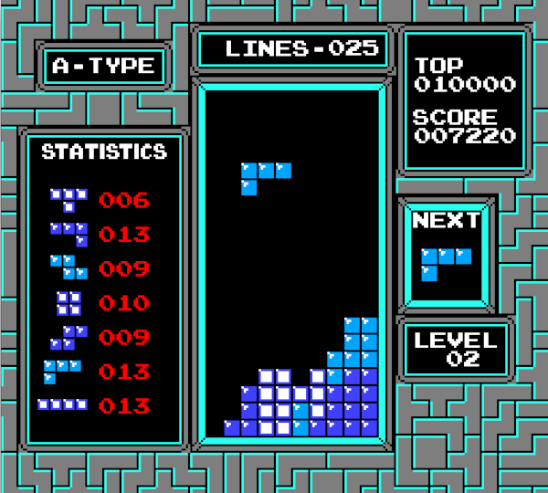

# sktetris

sktetris is remake of the original Nintendo Tetris (TM) game released on the
Nintendo Entertainment System (NES) in 1989.

## Core repository

This code is a clone with slight alterations to suit embedding in the Arcade Machine. 
The game's master code repository is at https://github.com/isdampe/sktetris.

## Compiling

Ensure you have `skm` and `make` installed. Then simply execute `make`.

## Customising the screen resolution

sktetris renders a world based on the NTSC Nintendo Entertainment System
screen solution of 256 x 240 pixels running at 60HZ. Scaled resolution support is built in.

To configure a scaled resolution, edit `src/Render.h` and change `SK_TETRIS_SCALE` to an appropriate value. This has been set to `3` for arcade machine use, yielding a resolution of 768 x 720.

## Todo / you could extend...

- Introduction screen
- Line animations
- Game over animations
- High score screen and score storage