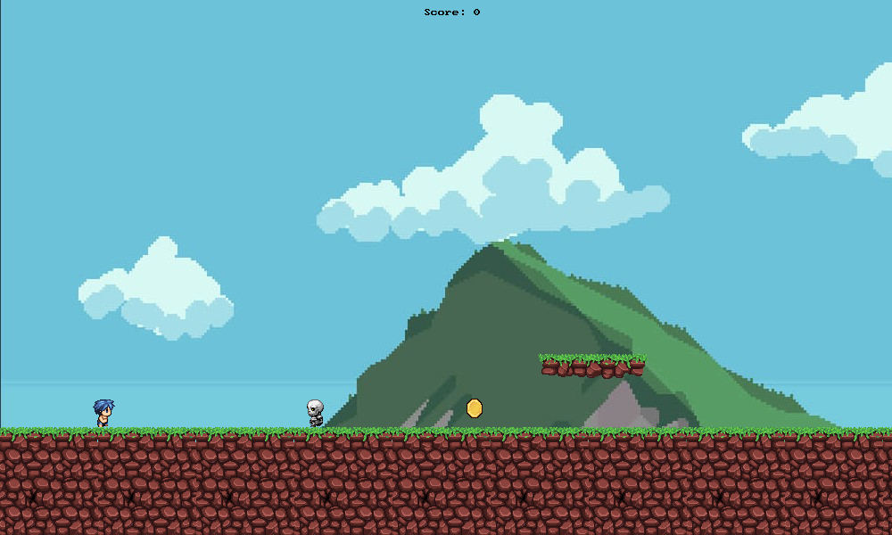

# SplashKit Mario

1. Requires a [SplashKit installation](https://splashkit.io/installation/).
2. Build using `skm clang++ *.cpp -o splashkit-mario` while in the project folder.
3. Run using `./splashkit-mario` while in the project folder.

_See also: usage documentation for [skm](https://github.com/splashkit/skm/blob/master/README.MD) and [SplashKit](https://splashkit.io/guides/using-splashkit/0-overview/)._

## Technical overview

- **Language:** C++
- **Current scope:** Small
- **Code quality:** Poor
- **Gameplay implementation:** N/A (made for a tutorial)

## Gameplay overview

A basic platforming demo made for a SplashKit tutorial.

### Player 1 Controls

| Action       | Key         |
|--------------|-------------|
| Move up      | Up arrow    |
| Move Left    | Left arrow  |
| Move Right   | Right arrow |

## Other notes

- Issues in the game's implementation make this a poor choice to learn well-structured program design - though it does an adequate job of providing a demonstration of several of SplashKit's functions which was its intended purpose.

## Screenshots

## Credits

Originally created by Kartik Kaushik in 2024-T1.
